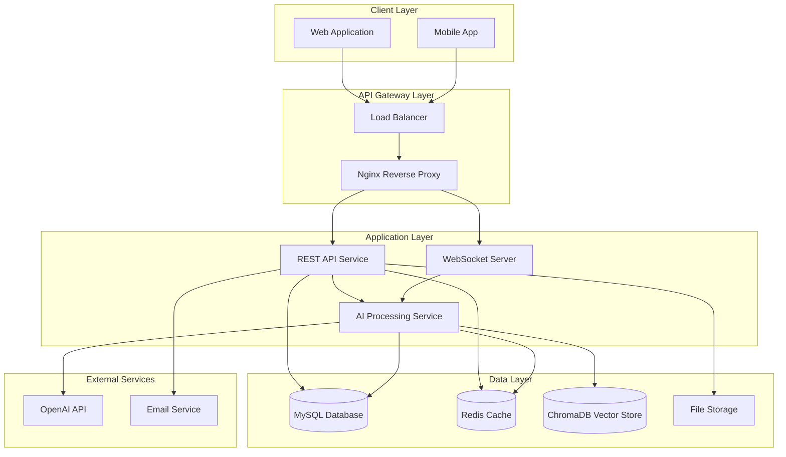
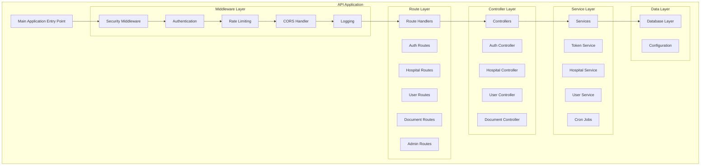
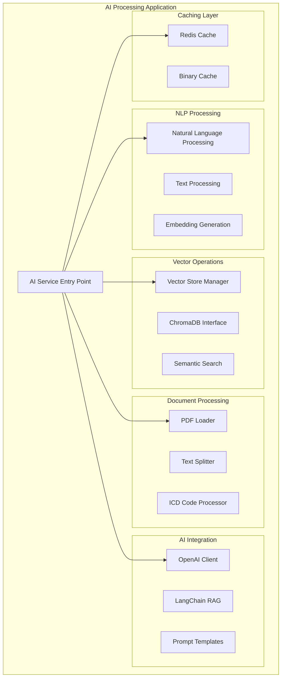
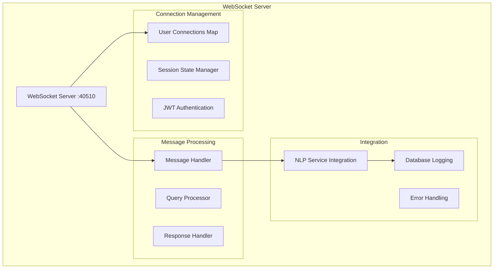
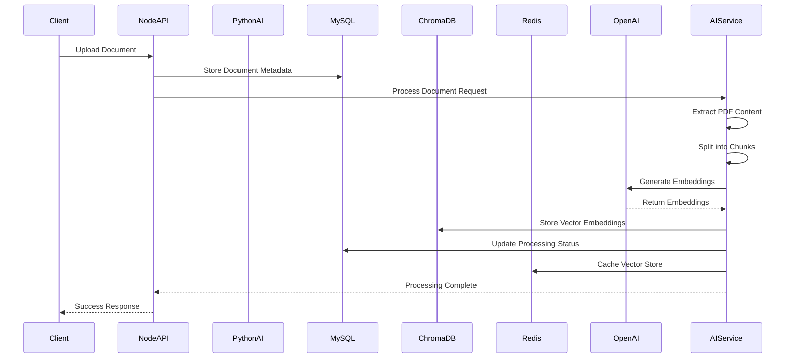
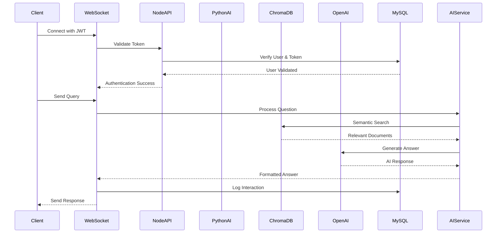
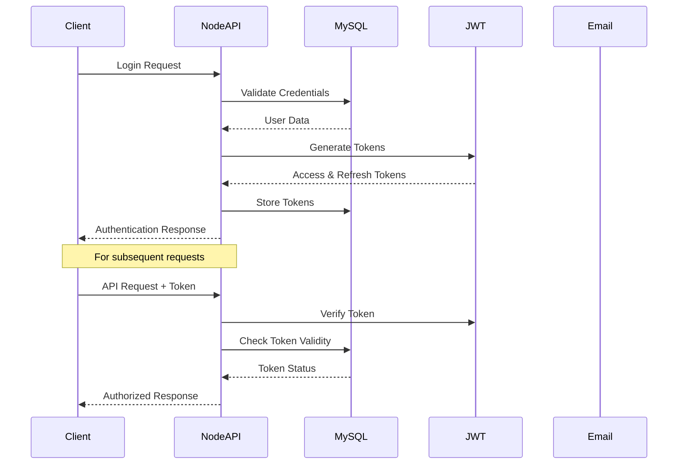
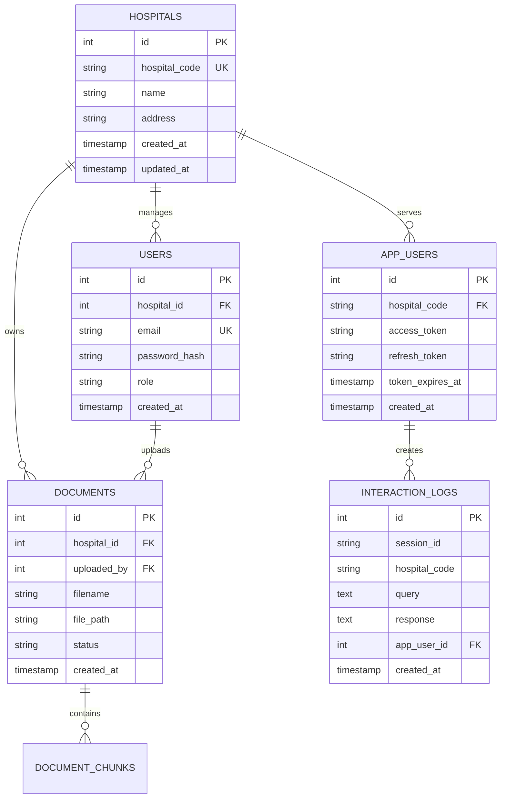
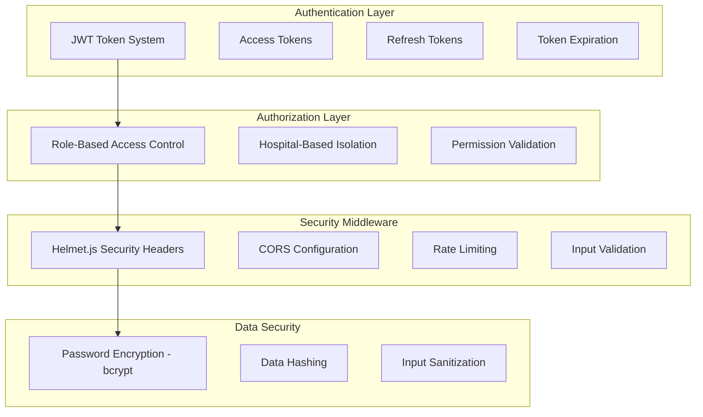
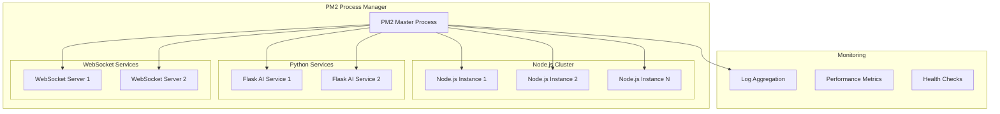

# SpurrinAI Backend - Architecture Documentation

## Table of Contents
1. [System Overview](#system-overview)
2. [High-Level Architecture](#high-level-architecture)
3. [Component Architecture](#component-architecture)
4. [Data Flow Architecture](#data-flow-architecture)
5. [Technology Stack](#technology-stack)
6. [Database Architecture](#database-architecture)
7. [Security Architecture](#security-architecture)
8. [Deployment Architecture](#deployment-architecture)

---

## System Overview

SpurrinAI is an intelligent document processing and question-answering system that leverages RAG (Retrieval Augmented Generation) architecture. The system processes medical documents, creates vector embeddings, and provides real-time AI-powered responses through a hybrid microservices architecture.

### Key Capabilities
- **Document Processing**: PDF ingestion and intelligent chunking
- **Vector Search**: ChromaDB-based semantic search with Redis caching
- **Real-time Chat**: WebSocket-based communication with AI responses
- **Multi-tenancy**: Hospital-based data isolation
- **AI Integration**: Natural language processing with external AI services

---

## High-Level Architecture



---

## Component Architecture

### 1. Primary API Service



### 2. AI Processing Service (NLP/RAG Engine)



### 3. WebSocket Communication Layer



---

## Data Flow Architecture

### 1. Document Processing Flow



### 2. Real-time Chat Flow



### 3. User Authentication Flow



---

## Technology Stack

### Backend Services
```yaml
Primary API Server:
  Architecture: RESTful API
  Pattern: MVC (Model-View-Controller)
  Features: Middleware Pipeline, Route Handling
  
AI Processing Service:
  Architecture: Microservice
  Pattern: Service-Oriented Architecture
  Features: NLP Processing, Vector Operations
  
Process Manager:
  Features: Clustering, Auto-restart, Monitoring
  Pattern: Process Orchestration
```

### Data Storage
```yaml
Primary Database:
  Type: MySQL 2.18.1 / MySQL2 3.2.0
  Features: Connection Pooling, Retry Logic
  
Vector Database:
  Type: ChromaDB
  Purpose: Semantic Search, Embeddings Storage
  
Cache Layer:
  Type: Redis
  Purpose: Session Cache, Vector Store Cache
  
File Storage:
  Type: Local File System
  Purpose: Document Storage, Uploads
```

### AI/ML Stack
```yaml
NLP Processing:
  - Natural Language Understanding
  - Text Preprocessing & Tokenization
  - RAG (Retrieval Augmented Generation)
  - External AI API Integration
  
Vector Operations:
  - Embedding Generation
  - Vector Database Storage
  - Semantic Search & Retrieval
  
Document Processing:
  - Text Chunking & Splitting
  - PDF Content Extraction
  - Medical Code Processing
```

### Communication
```yaml
Real-time:
  Protocol: WebSocket (ws 8.13.0)
  Library: Socket.IO 4.8.1
  
HTTP API:
  Protocol: REST
  Security: JWT Authentication
  
External APIs:
  - OpenAI API
  - Email Services (Nodemailer)
```

---

## Database Architecture

### Entity Relationship Overview



### Database Configuration
```yaml
Connection Pool:
  Max Connections: 10
  Queue Limit: 0
  Connection Timeout: 10s
  Idle Timeout: 60s
  Keep Alive: Enabled
  
Retry Logic:
  Max Retries: 3
  Backoff Strategy: Exponential
  Retry Conditions:
    - PROTOCOL_CONNECTION_LOST
    - ECONNRESET
    - PROTOCOL_ENQUEUE_AFTER_FATAL_ERROR
```

---

## Security Architecture

### Authentication & Authorization



### Security Features
```yaml
Authentication:
  Method: JWT (JSON Web Tokens)
  Token Types: Access & Refresh
  Expiration: Configurable
  Storage: Database + Redis Cache
  
Password Security:
  Hashing: bcrypt (5.1.1)
  Salt Rounds: Configurable
  Validation: Joi Schema Validation
  
Request Security:
  Headers: Helmet.js
  CORS: Configurable Origins
  Rate Limiting: Express Rate Limit
  Input Validation: Joi Schemas
  
Data Isolation:
  Multi-tenancy: Hospital-based
  Vector Store: Hospital-specific collections
  Database: Hospital ID filtering
```

---

## Deployment Architecture

### Process Management



### Service Configuration
```yaml
Node.js API:
  Port: 3000 (configurable)
  Instances: Auto (CPU cores)
  Restart Policy: Always
  Max Memory: 1GB
  
Python AI Service:
  Port: 5000
  Instances: 1-2
  Restart Policy: Always
  Max Memory: 2GB
  
WebSocket Server:
  Port: 40510
  Instances: 1-2
  Protocol: ws://
  Max Connections: 1000
  
Logging:
  Levels: INFO, ERROR, DEBUG
  Rotation: Daily
  Retention: 30 days
  Format: JSON structured
```

### Environment Configuration
```yaml
Development:
  Debug: Enabled
  Hot Reload: Nodemon
  Database: Local MySQL
  Cache: Local Redis
  
Production:
  Debug: Disabled
  Process Manager: PM2
  Database: Production MySQL
  Cache: Redis Cluster
  SSL: Required
  Monitoring: Enabled
```

---

## Performance Considerations

### Optimization Strategies
```yaml
Database:
  - Connection pooling with retry logic
  - Query optimization with indexes
  - Hospital-based data partitioning
  
Caching:
  - Redis for vector store caching
  - Session state caching
  - Query result caching (1 hour TTL)
  
Vector Operations:
  - Batch processing for embeddings
  - Chunked document processing
  - Async vector store operations
  
WebSocket:
  - Connection pooling
  - Message queuing
  - Graceful connection cleanup
```

### Scalability Features
```yaml
Horizontal Scaling:
  - Stateless API design
  - Load balancer ready
  - Database connection pooling
  
Vertical Scaling:
  - Memory-efficient processing
  - Async operations
  - Resource monitoring
  
Data Scaling:
  - Hospital-based partitioning
  - Vector store sharding
  - Incremental processing
```

---

*This documentation provides a comprehensive overview of the SpurrinAI backend architecture. For implementation details, refer to the source code and individual component documentation.*
